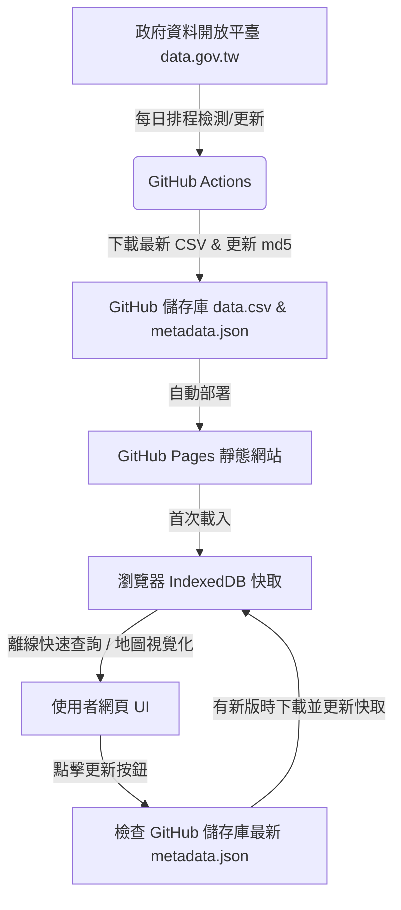

# 省道里程樁查詢系統

本專案是一個專為手機與電腦設計的**省道里程樁定位、地圖視覺化與導航查詢系統**。
資料來源對接交通部公路局每月更新之「省道里程坐標（里程牌標誌）」開放資料（資料集識別碼：7040）。

本專案採用 **Serverless 靜態網頁架構**，結合 **GitHub Actions** 與 **瀏覽器 IndexedDB 快取技術**，免去了手動複製貼上資料的繁瑣，實現全自動更新，且首頁開啟載入速度僅需數十毫秒。

- 預覽效果與 AppSheet 原理一致，但排版更具科技質感，操作更加流暢。
- **永久免費網址**：上傳至您的 GitHub 後，可透過 GitHub Pages 取得專屬的永久 URL 供隨時存取。

---

## 🎨 設計概念 (Design Concepts)

本系統的設計宗旨是「**極速、免維護、行動優先、一鍵導航**」。我們捨棄了傳統「後端資料庫 + API 伺服器」的繁重架構，改用現代前端與自動化技術實現：



### 1. 無伺服器 (Serverless) 靜態網頁架構
- **極低載入延遲**：網頁由純 HTML5, CSS3, Vanilla JS 組成，無須經過後端 API 伺服器進行資料查詢與傳輸。
- **IndexedDB 快取**：首次進入網頁時，瀏覽器會一次性下載並解析政府約 6MB 的 30,000+ 筆里程數據，隨後將其轉化為結構化物件儲存在瀏覽器的 `IndexedDB` 本地資料庫。之後每次打開網頁，均直接從本機讀取，載入時間小於 50 毫秒，且幾乎不消耗行動網路流量。

### 2. 全自動資料更新管線 (Auto-Update Pipeline)
- **排程偵測 (GitHub Actions)**：每天凌晨由 GitHub Actions 自動啟動 Python 爬蟲腳本 `update_data.py`。
- **動態解析**：由於政府開放平臺下載連結的 `md5_url` 會隨每月資料更新而改變，腳本會自動爬取資料集網頁、解析出最新下載點，並比對本地 `metadata.json`。
- **零手動維護**：若有新版本，腳本會自動下載最新 CSV 覆蓋儲存庫檔案，並提交 (Commit) 與推送 (Push) 回儲存庫，自動觸發 GitHub Pages 重新部署。

### 3. 地圖與導航整合 (GIS Integration)
- **免金鑰地圖 (Leaflet.js & OpenStreetMap)**：採用開源地圖框架，無須申請 Google Maps JavaScript API 金鑰，完全免費且免除流量計費風險。
- **深色科技美學 (CartoDB Dark Matter)**：選用高質感深色地圖底圖，搭配發光科技感標記，在夜間或路途行駛中閱讀更舒適。
- **原生導航喚起**：地圖僅做為定點與路網路線（Polyline）視覺化展示，導航功能則透過 Google 地圖 API 一鍵呼叫，讓使用者直接喚醒手機內建的 Google Maps App 進行路徑規劃。

### 4. 響應式佈局 (Mobile-First responsive RWD)
- **電腦版**：左側固定寬度側邊欄 (Sidebar)，可進行分頁切換、搜尋與公路瀏覽；右側為滿版 Leaflet 地圖，並以懸浮玻璃擬態卡片 (Glassmorphism Card) 呈現詳細屬性。
- **手機版**：底部導覽列 (Tab Bar) 控制三大主要分頁（公路列表、地圖檢視、快速搜尋）。詳細資訊以底部抽屜 (Bottom Sheet) 呈現，非常適合單手操作。

---

## 📱 使用方式 (Usage Guide)

### 1. 瀏覽公路與里程樁
- 進入「**公路列表**」分頁，您會看到所有省道公路名稱，右側標記有該公路的里程樁總點數。
- 在上方輸入框可篩選公路（如輸入「台1」或「台9」）。
- 點選任一公路後，側邊欄會切換至該公路的里程座標清單，同時地圖會自動縮放並**以藍色虛線繪製出整條公路的軌跡**。
- 點選任一里程樁，地圖會平滑聚焦（FlyTo）至該座標點，並彈出詳細資訊。

### 2. 快速搜尋里程樁
- 進入「**快速搜尋**」分頁。
- 支援**多關鍵字空格交叉搜尋**，例如：
  - 輸入 `台1 45K`：快速定位至台1線 45K+000 處。
  - 輸入 `台9 花蓮`：尋找台9線在花蓮縣境內的所有里程樁。
  - 輸入 `中正區`：列出所有位於台北市中正區的省道里程樁。
- 點擊搜尋結果，系統會自動切換至地圖並聚焦定位。

### 3. 一鍵複製座標與導航
- 在里程樁詳細資訊面板中：
  - 點擊 **「複製座標」**：會將 WGS84 經緯度（例如 `25.0456725,121.5196315`）複製至手機或電腦的剪貼簿。
  - 點擊 **「開始導航」**：會開啟新視窗並自動喚醒 Google Maps App，並以該里程座標為目的地進行導航。

### 4. 手動檢查更新
- 系統每天會自動在 GitHub 端同步政府資料。
- 使用者可點擊網頁左上角的 **「檢查更新」** 按鈕，網頁會即時下載儲存庫最新的 `metadata.json`。
- 若偵測到新版本，會跳出對話框提示，同意後即會重新下載最新 CSV 並寫入瀏覽器快取，不需重新整理網頁。

---

## 🛠️ 本地開發與測試

本專案無任何前端編譯步驟（No Build Tools），只要啟動一個簡單的本地伺服器即可運作：

1. 開啟終端機並進入專案目錄：
   ```bash
   cd thb-milestone-query
   ```
2. 啟動 Python 內建輕量伺服器：
   ```bash
   python3 -m http.server 8080
   ```
3. 在瀏覽器打開以下網址進行測試：
   [http://localhost:8080](http://localhost:8080)

---

## 🚀 GitHub 上傳與 Pages 永久網址部署指南

請按照以下步驟將本專案發布至您的 GitHub 並啟用免費的永久網址：

### 第一步：在 GitHub 上建立新儲存庫 (Repository)
1. 登入您的 [GitHub 帳號](https://github.com/)。
2. 點擊右上角 `+` -> **New repository**。
3. 設定 Repository name 為：`thb-milestone-query`。
4. 設為 **Public**（公開），且**不要**勾選 "Initialize this repository with a README"（因為專案中已包含此檔案）。
5. 點擊 **Create repository**。

### 第二步：上傳本地專案代碼
在您的本地終端機（確保在 `thb-milestone-query` 資料夾下）執行以下指令：

```bash
# 1. 提交檔案至 Git 本地快取
git add .

# 2. 建立提交紀錄
git commit -m "feat: 實作省道里程樁查詢系統與自動更新機制"

# 3. 強制使用 main 做為預設分支
git branch -M main

# 4. 關聯到您剛剛建立的 GitHub 儲存庫 (請將 <your-username> 換成您的 GitHub 帳號)
git remote add origin https://github.com/<your-username>/thb-milestone-query.git

# 5. 上傳代碼
git push -u origin main
```

### 第三步：啟用 GitHub Pages (取得永久網址)
1. 在 GitHub 網頁上，進入您的 `thb-milestone-query` 儲存庫。
2. 點選上方的 **Settings**（設定）。
3. 在左側選單中找到並點選 **Pages**。
4. 在 **Build and deployment** 下的 **Source** 選擇 `Deploy from a branch`。
5. 在 **Branch** 選項中，選擇 `main`，並將資料夾設為 `/ (root)`。
6. 點擊 **Save**。
7. 稍等約 1 分鐘，重新整理頁面，最上方會出現您的專案永久網址：
   `https://<your-username>.github.io/thb-milestone-query/`

### 第四步：設定 GitHub Actions 自動更新權限
為了讓自動更新腳本能在每日偵測到新資料時，自動將資料寫入並提交回您的 GitHub，您需要開啟寫入權限：
1. 依然在儲存庫的 **Settings**（設定）頁面。
2. 點選左側選單的 **Actions** -> **General**。
3. 滾動到最下方找到 **Workflow permissions**。
4. 將預設的 "Read repository contents and packages permissions" 改選為 **"Read and write permissions"**。
5. 點擊 **Save** 儲存。

> 🎉 至此已設定完畢！系統將於每日凌晨自動檢查政府資料，若有更新便會更新網頁，您只需打開您的 Pages 永久網址即可隨時使用最精準的里程資料！
